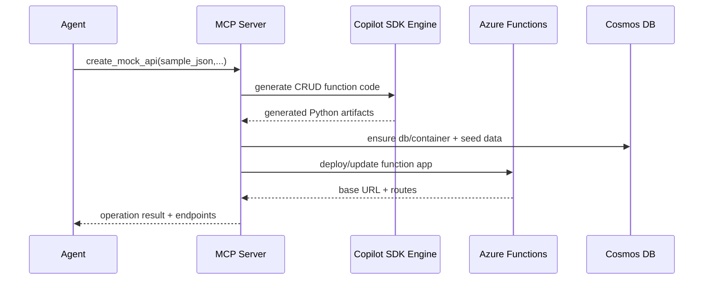

# Architecture

## 1. High-Level Design

The solution consists of a Python MCP server that orchestrates two generation paths:

1. **Mock API generation path**
   - Build CRUD Azure Functions code from input schema
   - Provision/validate Cosmos DB serverless resources
   - Seed data and deploy API

2. **Synthetic data generation path**
   - Generate batch scripts/prompts based on sample schema + field semantics
   - Execute generation and validation pipeline
   - Insert data into Cosmos DB for immediate API usage

## 2. Core Components

### 2.1 MCP Server (Python + FastMCP)
Responsibilities:
- Expose MCP tools
- Validate input payloads
- Manage operation lifecycle (queued/running/succeeded/failed)
- Orchestrate code generation and deployment tasks

### 2.2 Generation Engine (GitHub Copilot SDK)
Responsibilities:
- Produce Python Azure Function handlers
- Produce data-generation Python scripts
- Regenerate/fix when validation fails

### 2.3 Deployment Engine
Responsibilities:
- Create/update Azure Function App artifacts
- Configure app settings (Cosmos endpoint/db/container)
- Trigger deployment and capture status

### 2.4 Data Layer (Azure Cosmos DB Serverless)
Responsibilities:
- Store API resource documents
- Serve as backing store for generated API handlers
- Receive seeded and synthetic records

### 2.5 Status & Metadata Store
Responsibilities:
- Track operations and errors
- Persist mapping of deployment id -> API URLs/resources

## 3. Runtime Flow

### 3.1 `create_mock_api`
1. MCP receives request with `sample_records` and deployment metadata.
2. Validate schema and infer types/id strategy.
3. Invoke generation engine to create CRUD handler code.
4. Provision/check Cosmos database/container.
5. Upsert sample records.
6. Deploy handlers to Azure Functions.
7. Return operation status and endpoint metadata.

### 3.2 `generate_synthetic_data`
1. MCP receives example records, field descriptions, and count.
2. Build generation prompt/spec and batch plan.
3. Run generation script in batches.
4. Validate records against inferred schema.
5. Upload to Cosmos container.
6. Return generation summary and status.

## 4. API Design (Generated Service)

For resource `{resource}`:
- `POST /api/{resource}`
- `GET /api/{resource}`
- `GET /api/{resource}/{id}`
- `PATCH /api/{resource}/{id}`
- `DELETE /api/{resource}/{id}`

List filtering (MVP):
- Exact-match scalar query parameters
- Example: `GET /api/products?category=shoes&active=true`

OpenAPI output (MVP):
- Generate a basic OpenAPI/Swagger document for generated endpoints.

## 5. Data Model Strategy

- Input sample records define baseline schema.
- Required fields inferred from sample presence frequency (MVP heuristic).
- `id` policy:
  - Use provided `id` field if present and unique.
  - Else generate UUID at insert time.
- Default partition key: `/id` (MVP).

## 6. Validation Rules

- Schema validation before generation.
- Generated code sanity checks (imports, function signatures, lint pass optional).
- Synthetic record validation:
  - Required fields present
  - Primitive type compatibility
  - Basic format checks (email/date if described)

Invalid records are retried per batch threshold; if still invalid, operation fails with diagnostics.

Synthetic generation limits (MVP):
- Default maximum is 10,000 records per operation.

## 7. Error Handling

- Every long-running action has `operation_id`.
- Failure states include machine-readable `error_code` and `error_message`.
- Retry policy:
  - Generation retries: limited (e.g., 2 attempts)
  - Azure transient retries: exponential backoff
  - Cosmos write retries: SDK-native retry + capped custom retry

## 8. Security Design

- No secret material in prompts or source files.
- Use managed identity where possible for Azure resource access.
- Store required secrets in Azure Key Vault or app settings.
- Restrict MCP tool inputs to approved Azure subscriptions/resource groups if needed.

## 9. Observability

- Structured JSON logs from MCP and deployment tasks.
- Correlation fields: `operation_id`, `deployment_id`, `resource_name`.
- Metrics:
  - generation duration
  - deployment duration
  - records generated/uploaded
  - failure counts by stage

## 10. Proposed Repository Layout

```text
mcp-api-mock-gen/
  README.md
  PRD.md
  ARCHITECTURE.md
  src/
    server.py
    tools/
      create_mock_api.py
      generate_synthetic_data.py
      get_operation_status.py
    generation/
      api_codegen.py
      synthetic_codegen.py
      validators.py
    deployment/
      azure_functions.py
      cosmos.py
    models/
      contracts.py
      operations.py
  tests/
    test_contracts.py
    test_schema_inference.py
    test_validation.py
```

## 11. Deployment Options

### Option A (MVP selected)
Function App per generated API domain.
- Pros: isolation, cleaner lifecycle per API
- Cons: more deployment overhead

### Option B (Future optimization)
Single Azure Function App hosting multiple generated resources as routes.
- Pros: simpler management, fewer resources
- Cons: shared scaling and blast radius

## 12. Sequence Diagram (Logical)



## 13. Future Extensions

- Client SDK export from generated OpenAPI specs
- Advanced filtering/sorting/pagination
- Multi-resource relationship generation
- Synthetic data quality scoring and drift checks
- Automatic UI scaffold generation pipeline integration
