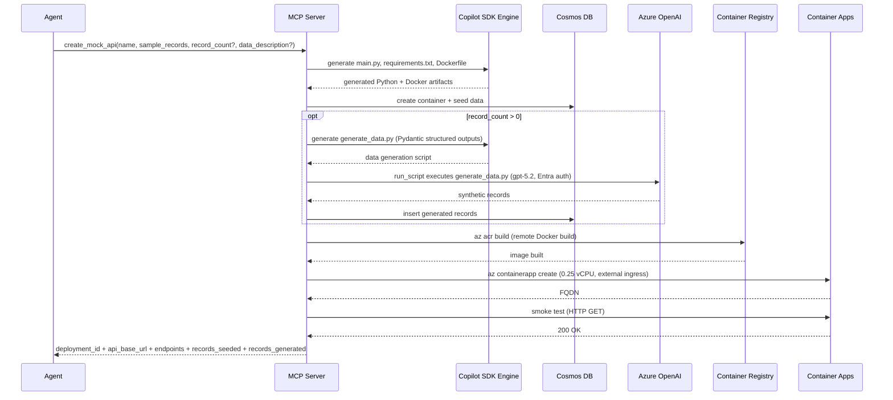

# Architecture

## 1. High-Level Design

The solution consists of a Python MCP server that orchestrates API generation and deployment as Docker containers:

1. **Mock API generation path**
   - Generate CRUD FastAPI code, Dockerfile, and requirements from input schema
   - Provision Cosmos DB container and seed data
   - Build Docker image via ACR remote build
   - Deploy to Azure Container Apps
   - Smoke-test the live endpoint

2. **Synthetic data generation path** (integrated into `create_mock_api`)
   - When `record_count > 0`, the Copilot SDK agent generates a `generate_data.py` script
   - The script uses Azure OpenAI Responses API (gpt-5.2) with structured outputs (Pydantic models derived from inferred schema)
   - Authenticates via Entra (`AzureCliCredential` + `get_bearer_token_provider`)
   - Azure OpenAI endpoint configurable via `AZURE_OPENAI_ENDPOINT` env var
   - Generated records are inserted directly into CosmosDB
   - The `run_script` skill executes the script locally

## 2. Core Components

### 2.1 MCP Server (Python + FastMCP)
Responsibilities:
- Expose MCP tools
- Validate input payloads
- Manage operation lifecycle (queued/running/succeeded/failed)
- Orchestrate code generation and deployment tasks

### 2.2 Generation Engine (GitHub Copilot SDK)
Responsibilities:
- Produce `main.py` (FastAPI + uvicorn CRUD handlers)
- Produce `requirements.txt` and `Dockerfile`
- When synthetic data is requested, produce `generate_data.py` (Azure OpenAI Responses API with Pydantic structured outputs)
- Schema inference includes Pydantic model definitions for structured outputs
- Regenerate/fix when validation fails

### 2.3 Deployment Engine (Azure Container Apps)
Responsibilities:
- Build Docker images via ACR remote build (`az acr build`)
- Create per-request Container Apps via `az containerapp create`
- Use smallest sizing (0.25 vCPU, 0.5 Gi), external ingress on port 8000
- Assign a shared user-assigned managed identity for Entra-based Cosmos auth
- Set environment variables for Cosmos endpoint, database, container, and `AZURE_CLIENT_ID`
- Run smoke test (HTTP GET) to verify deployment accessibility
- Delete Container Apps and Cosmos containers on `delete_mock_api`

### 2.4 Data Layer (Azure Cosmos DB Serverless)
Responsibilities:
- Store API resource documents
- Serve as backing store for generated API handlers
- Receive seeded and synthetic records

### 2.5 Status & Metadata Store
Responsibilities:
- Track operations and errors
- Persist mapping of deployment id -> API URLs/resources

## 3. Runtime Flow

### 3.1 `create_mock_api`
1. MCP receives request with `name`, `sample_records`, and optional `record_count` / `data_description`.
2. Generate a unique deployment ID (8-char UUID4 prefix).
3. Validate schema and infer types/id strategy (including Pydantic model definitions).
4. Invoke generation engine to create `main.py`, `requirements.txt`, `Dockerfile`.
5. If `record_count > 0`, generation engine also creates `generate_data.py` (Azure OpenAI Responses API + Pydantic structured outputs).
6. Create Cosmos container (`{resource}_{deployment_id}`), seed sample records.
7. If `generate_data.py` was created, the `run_script` skill executes it locally to generate and insert synthetic records into CosmosDB.
8. Build Docker image via ACR remote build (`mock-{resource}-{deployment_id}:latest`).
9. Create Container App (`mock-{resource}-{deployment_id}`) with managed identity.
10. Smoke-test the live endpoint.
11. Return deployment ID, API base URL, endpoint metadata, `records_seeded`, and `records_generated`.

### 3.2 `delete_mock_api`
1. MCP receives `deployment_id`.
2. Delete the Container App.
3. Delete the Cosmos container.
4. Return status.

### 3.3 Synthetic data generation (within `create_mock_api`)
1. Copilot SDK agent generates `generate_data.py` using inferred schema and `data_description`.
2. The script uses Azure OpenAI Responses API (gpt-5.2, model `gpt-5.2`) with Pydantic models for structured outputs.
3. Authentication: `AzureCliCredential` + `get_bearer_token_provider` (Entra).
4. Endpoint configured via `AZURE_OPENAI_ENDPOINT` env var.
5. The `run_script` skill executes the script locally.
6. Generated records are validated and inserted directly into the CosmosDB container.
7. Result includes `records_seeded` and `records_generated` counts.

## 4. API Design (Generated Service)

For resource `{resource}`:
- `POST /{resource}`
- `GET /{resource}`
- `GET /{resource}/{id}`
- `PATCH /{resource}/{id}`
- `DELETE /{resource}/{id}`

List filtering (MVP):
- Exact-match scalar query parameters
- Example: `GET /products?category=shoes&active=true`

OpenAPI output (MVP):
- Generate a basic OpenAPI/Swagger document for generated endpoints.

## 5. Data Model Strategy

- Input sample records define baseline schema.
- Required fields inferred from sample presence frequency (MVP heuristic).
- `id` policy:
  - Use provided `id` field if present and unique.
  - Else generate UUID at insert time.
- Default partition key: `/id` (MVP).

## 6. Validation Rules

- Schema validation before generation.
- Generated code sanity checks (imports, function signatures, lint pass optional).
- Synthetic record validation:
  - Required fields present
  - Primitive type compatibility
  - Basic format checks (email/date if described)

Invalid records are retried per batch threshold; if still invalid, operation fails with diagnostics.

Synthetic generation limits (MVP):
- Default maximum is 10,000 records per operation.

## 7. Error Handling

- Every long-running action has `operation_id`.
- Failure states include machine-readable `error_code` and `error_message`.
- Retry policy:
  - Generation retries: limited (e.g., 2 attempts)
  - Azure transient retries: exponential backoff
  - Cosmos write retries: SDK-native retry + capped custom retry

## 8. Security Design

- No secret material in prompts or source files.
- Entra-only authentication for all Azure resources — shared keys disabled.
- User-assigned managed identity shared across all generated Container Apps.
- CosmosDB local auth disabled; access via Cosmos SQL RBAC role assigned to the MI.
- ACR Pull role assigned to the MI for image pulls.
- `AZURE_CLIENT_ID` environment variable tells `DefaultAzureCredential` which MI to use.
- Current user gets Cosmos RBAC and ACR Push for development/seeding.
- Required secrets (subscription, endpoints, `AZURE_OPENAI_ENDPOINT`) loaded from `.env` at server startup — never committed.

## 9. Observability

- Structured JSON logs from MCP and deployment tasks.
- Correlation fields: `operation_id`, `deployment_id`, `resource_name`.
- Metrics:
  - generation duration
  - deployment duration
  - records generated/uploaded
  - failure counts by stage

## 10. Repository Layout

```text
mcp-api-mock-gen/
  README.md
  PRD.md
  ARCHITECTURE.md
  AGENTS.md
  pyproject.toml
  .env.example           # Template for required env vars
  infra/
    main.tf              # Terraform shared infra (RG, CosmosDB, ACR, ACA Env, MI, RBAC)
    variables.tf
    outputs.tf
  src/
    mcp_api_mock_gen/
      __init__.py
      server.py           # FastMCP server exposing create_mock_api + delete_mock_api
      codegen.py           # Copilot SDK orchestration (session + prompt)
      config.py            # Settings loaded from env vars
      contracts.py         # Pydantic models for tool I/O
      schema.py            # Schema inference from sample records
      skills/
        __init__.py
        cosmos.py          # CosmosDB skills (az CLI + sync SDK)
        acr.py             # ACR remote build skill
        container_apps.py  # Container App create/delete + smoke test
        scripts.py         # Script execution skill (run_script for data generation)
  tests/
    __init__.py
    test_client.py         # FastMCP in-process client test
```

### Naming convention

- Container App: `mock-{resource}-{deployment_id}`
- Cosmos container: `{resource}_{deployment_id}`
- ACR image: `mock-{resource}-{deployment_id}:latest`

### Terraform shared infrastructure (`infra/`)

The `infra/` directory contains Terraform that provisions resources shared by all generated APIs:
- Resource Group
- CosmosDB serverless account (Entra-only, local auth disabled)
- Azure Container Registry (Basic SKU)
- Container Apps Environment (no Log Analytics workspace for speed)
- User-assigned managed identity with pre-provisioned Cosmos RBAC (Contributor) and ACR Pull
- Current user: Cosmos RBAC and ACR Push

Container Apps are **not** Terraform-managed — they are created/deleted per-request at runtime via `az` CLI.

## 11. Deployment Model

Container App per generated API resource.
- Each `create_mock_api` call produces one Container App with a unique deployment ID.
- Isolation per API; independent lifecycle and scaling.
- `delete_mock_api` removes the Container App and its Cosmos container.

## 12. Sequence Diagram (Logical)



## 13. Future Extensions

- Client SDK export from generated OpenAPI specs
- Advanced filtering/sorting/pagination
- Multi-resource relationship generation
- Synthetic data quality scoring and drift checks
- Automatic UI scaffold generation pipeline integration
