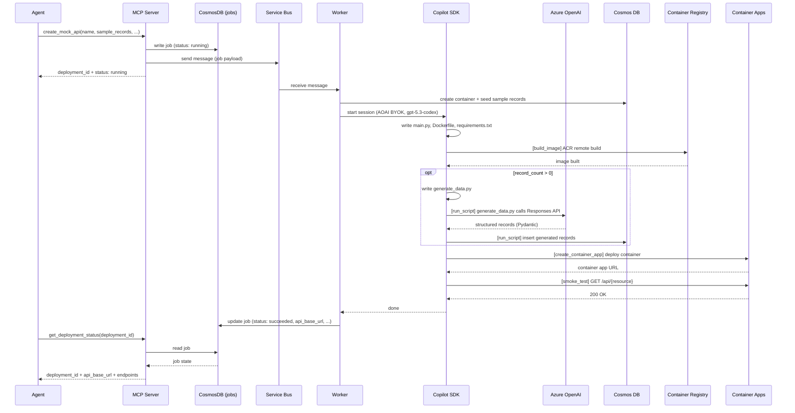

# Architecture

## High-Level Design

A FastMCP server exposes three tools (`create_mock_api`, `get_deployment_status`, `delete_mock_api`). The server is lightweight — it writes job state to a CosmosDB "jobs" container, sends a message to a Service Bus queue, and serves poll requests. A separate Worker service receives messages from the queue and runs the Copilot SDK with all skills (ACR build, data gen, Container Apps deploy, smoke test), writing results back to CosmosDB state. Both services run in Azure Container Apps. Docker images are published to GHCR and deployed by Terraform.

## Components

### MCP Server (FastMCP)
- Exposes `create_mock_api`, `get_deployment_status`, and `delete_mock_api`
- Lightweight: no Copilot SDK, no codegen
- Writes job state to CosmosDB "jobs" container
- Sends message to Service Bus queue `mock-api-jobs`
- Reads state for polling (`get_deployment_status`)
- 1 replica, with ingress, StreamableHTTP transport, API key protected

### Worker
- Receives messages from Service Bus queue `mock-api-jobs`
- Runs GitHub Copilot SDK (Azure OpenAI BYOK, gpt-5.3-codex)
- Executes all skills: ACR build, data gen, Container Apps deploy, smoke test
- Writes results back to CosmosDB "jobs" container
- 3-10 replicas, scales based on queue depth (KEDA), 2 vCPU / 4Gi each, no ingress

### Service Bus
- Azure Service Bus Standard tier
- Queue: `mock-api-jobs`
- Entra auth (no connection strings/keys)
- Decouples MCP server from Worker processing

### State Store (CosmosDB "jobs" container)
- Stores deployment job state (status, results, errors)
- Shared between MCP server (read/write) and Worker (read/write)
- Part of the existing CosmosDB serverless account

### Generation Engine (GitHub Copilot SDK) — runs in Worker
- Azure OpenAI BYOK (gpt-5.3-codex, Responses API wire format)
- Writes files via built-in file tools: `main.py`, `Dockerfile`, `requirements.txt`, optionally `generate_data.py`
- Calls custom tools provided by MCP server: `build_image`, `run_script`, `create_container_app`, `smoke_test`
- Self-corrects on failure: reads errors, fixes code, retries

### Data Layer (Azure Cosmos DB Serverless)
- Entra-only auth (local auth disabled)
- Shared database: `mockapi`
- One container per API: `{resource}_{deployment_id}`

### Data Generation Script (`generate_data.py`)
- Generated by the Copilot SDK when `record_count > 0`
- Uses `openai` library with `AzureOpenAI` client
- Auth: `ManagedIdentityCredential` or `AzureCliCredential` depending on environment
- Responses API with `text_format` (Pydantic structured outputs)
- Model name from `DATAGEN_MODEL` env var
- Generates in batches, inserts into CosmosDB

### Generated API
- FastAPI with sync Cosmos SDK + `ManagedIdentityCredential`
- Endpoints: `POST /api/{resource}`, `GET /api/{resource}`, `GET /api/{resource}/{id}`, `PATCH /api/{resource}/{id}`, `DELETE /api/{resource}/{id}`
- `enable_cross_partition_query=True` for list queries
- Dockerized, deployed to Container Apps

## Runtime Flow

### `create_mock_api(name, sample_records, record_count, data_description)`
Writes job state (`accepted`) to CosmosDB "jobs" container and sends a message to Service Bus queue `mock-api-jobs`. Returns immediately with `deployment_id` + `status: "accepted"`.

The Worker picks up the message and reports progress through these states:

| Status | Description |
|---|---|
| `accepted` | Job created, message sent to queue |
| `provisioning` | Creating CosmosDB container, seeding sample data |
| `generating_code` | Copilot SDK session started, writing API code |
| `building_image` | ACR remote build running |
| `generating_data` | Running data generation script (if record_count > 0) |
| `deploying` | Creating Container App |
| `smoke_testing` | Verifying API returns 200 OK |
| `succeeded` | API is live, URL available |
| `failed` | Something went wrong, error field has details |

Worker steps:
1. Creates CosmosDB container via `az` CLI, seeds `sample_records` via sync Cosmos SDK.
2. Starts Copilot SDK session (Azure OpenAI BYOK, gpt-5.3-codex).
3. SDK writes files: `main.py`, `Dockerfile`, `requirements.txt`, optionally `generate_data.py`.
4. SDK calls custom tools in a loop (self-correcting on errors):
   - **`build_image`** — sends code to ACR remote build (`az acr build --no-logs`), gets Docker image
   - **`run_script`** (if `record_count > 0`) — executes `generate_data.py` which calls Azure OpenAI Responses API with Pydantic structured outputs, then inserts records into CosmosDB
   - **`create_container_app`** — deploys the image as a Container App (`az containerapp create`, 0.25 vCPU, 0.5Gi, external ingress, user-assigned MI)
   - **`smoke_test`** — HTTP GET to the deployed Container App, retries up to 3 times, verifies 200 OK
5. Updates job state in CosmosDB to `succeeded` or `failed`.

### `get_deployment_status(deployment_id)`
Reads current state from CosmosDB "jobs" container. Poll until `status` is `succeeded` or `failed`.

### `delete_mock_api(deployment_id)`
1. Find container apps and Cosmos containers by naming convention (suffix = `deployment_id`).
2. Delete both via `az` CLI.

## Naming Convention

| Resource | Pattern |
|---|---|
| Container App | `mock-{resource}-{deployment_id}` |
| Cosmos container | `{resource}_{deployment_id}` |
| ACR image | `mock-{resource}-{deployment_id}:latest` |
| Cosmos database | `mockapi` (shared) |
| Deployment ID | 8-char UUID4 prefix |

## Infrastructure (Terraform — `infra/`)

All shared infrastructure provisioned by Terraform:

| Resource | Details |
|---|---|
| Resource Group | Single RG for all resources |
| CosmosDB serverless | Entra-only, local auth disabled; "jobs" container for state |
| Service Bus (Standard) | Queue `mock-api-jobs`, Entra auth |
| Container Registry | Basic SKU, ACR remote build for API images |
| Container Apps Environment | No Log Analytics |
| AI Foundry | `kind=AIServices`, gpt-5.3-codex GlobalStandard deployment |
| User-assigned MI | Cosmos RBAC, ACR Pull, OpenAI User, Service Bus sender/receiver, Contributor on RG, Reader on sub |
| MCP server Container App | Lightweight, 1 replica, with ingress, deployed from GHCR (`agentic-component-factory:latest`) |
| Worker Container App | 3-10 replicas, KEDA scaling on queue depth, no ingress, deployed from GHCR (`agentic-component-factory-worker:latest`) |

Container Apps for generated APIs are **not** Terraform-managed — created/deleted at runtime via `az` CLI.

## Security

- Entra-only auth for all Azure resources — no shared keys
- User-assigned MI shared across all generated Container Apps
- CosmosDB access via Cosmos SQL RBAC role on the MI
- MCP server protected by API key (Bearer token in Authorization header)
- No secrets in source; config loaded from env vars / `.env`

## Repository Layout

```
src/mcp_api_mock_gen/
  server.py           FastMCP server (create_mock_api + delete_mock_api), lightweight
  state.py             CosmosDB job state read/write (jobs container)
  worker.py            Worker: Service Bus listener, runs Copilot SDK per message
  codegen.py           Copilot SDK orchestration, prompts, tool wiring
  config.py            Settings from environment variables
  contracts.py         Pydantic models for MCP I/O
  schema.py            Schema inference + Pydantic model generation
  skills/
    cosmos.py          CosmosDB: create container, seed data, delete
    acr.py             ACR remote build
    container_apps.py  Container App create/delete + smoke test
    scripts.py         Local script execution (run_script)
tests/
  test_client.py       In-process E2E test (stdio)
  test_remote.py       Remote E2E test (StreamableHTTP)
infra/                 Terraform for shared infrastructure + MCP server + Worker
run_server.py          MCP server Docker entrypoint
run_worker.py          Worker Docker entrypoint
Dockerfile             MCP server image
Dockerfile.worker      Worker image
entrypoint.sh          MCP server container entrypoint script
entrypoint_worker.sh   Worker container entrypoint script
```

## Sequence Diagram


