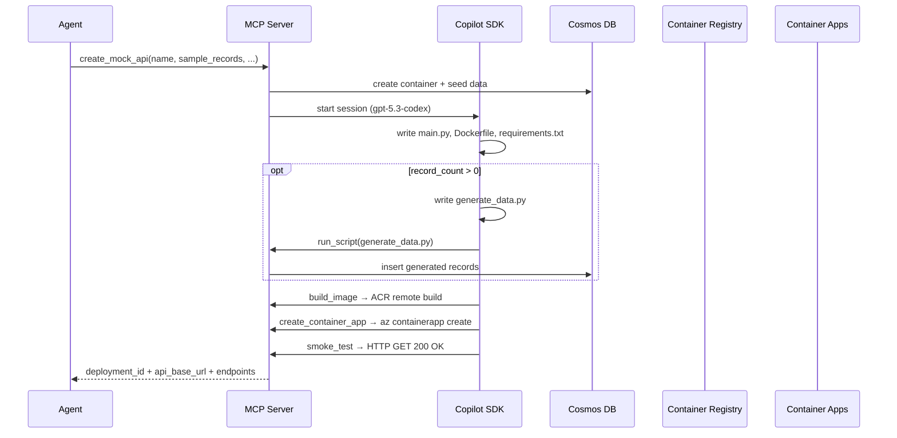

# Architecture

## High-Level Design

A FastMCP server exposes two tools (`create_mock_api`, `delete_mock_api`) that orchestrate API generation and deployment on Azure. The server runs in Azure Container Apps with StreamableHTTP transport, protected by API key (Bearer token). Docker image is published to GHCR and deployed by Terraform.

## Components

### MCP Server (FastMCP)
- Exposes `create_mock_api` and `delete_mock_api`
- Validates inputs, orchestrates code generation and deployment

### Generation Engine (GitHub Copilot SDK)
- Azure OpenAI BYOK (gpt-5.3-codex, Responses API wire format)
- Writes files via built-in file tools: `main.py`, `Dockerfile`, `requirements.txt`, optionally `generate_data.py`
- Calls custom tools provided by MCP server: `build_image`, `run_script`, `create_container_app`, `smoke_test`
- Self-corrects on failure: reads errors, fixes code, retries

### Data Layer (Azure Cosmos DB Serverless)
- Entra-only auth (local auth disabled)
- Shared database: `mockapi`
- One container per API: `{resource}_{deployment_id}`

### Data Generation Script (`generate_data.py`)
- Generated by the Copilot SDK when `record_count > 0`
- Uses `openai` library with `AzureOpenAI` client
- Auth: `ManagedIdentityCredential` or `AzureCliCredential` depending on environment
- Responses API with `text_format` (Pydantic structured outputs)
- Model name from `DATAGEN_MODEL` env var
- Generates in batches, inserts into CosmosDB

### Generated API
- FastAPI with sync Cosmos SDK + `ManagedIdentityCredential`
- Endpoints: `POST /api/{resource}`, `GET /api/{resource}`, `GET /api/{resource}/{id}`, `PATCH /api/{resource}/{id}`, `DELETE /api/{resource}/{id}`
- `enable_cross_partition_query=True` for list queries
- Dockerized, deployed to Container Apps

## Runtime Flow

### `create_mock_api(name, sample_records, record_count, data_description)`
1. Create CosmosDB container via `az` CLI, seed `sample_records` via sync Cosmos SDK.
2. Start Copilot SDK session (Azure OpenAI BYOK, gpt-5.3-codex).
3. SDK writes files: `main.py`, `Dockerfile`, `requirements.txt`, optionally `generate_data.py`.
4. SDK calls custom tools:
   - **`build_image`** — ACR remote build (`az acr build --no-logs`)
   - **`run_script`** — executes `generate_data.py` locally (Azure OpenAI Responses API with Pydantic structured outputs → records into CosmosDB)
   - **`create_container_app`** — `az containerapp create` (0.25 vCPU, 0.5Gi, external ingress, user-assigned MI)
   - **`smoke_test`** — HTTP GET with retries, verifies 200 OK
5. If any tool fails, SDK reads error, fixes code, retries.
6. Returns `deployment_id`, `api_base_url`, `endpoints`.

### `delete_mock_api(deployment_id)`
1. Find container apps and Cosmos containers by naming convention (suffix = `deployment_id`).
2. Delete both via `az` CLI.

## Naming Convention

| Resource | Pattern |
|---|---|
| Container App | `mock-{resource}-{deployment_id}` |
| Cosmos container | `{resource}_{deployment_id}` |
| ACR image | `mock-{resource}-{deployment_id}:latest` |
| Cosmos database | `mockapi` (shared) |
| Deployment ID | 8-char UUID4 prefix |

## Infrastructure (Terraform — `infra/`)

All shared infrastructure provisioned by Terraform:

| Resource | Details |
|---|---|
| Resource Group | Single RG for all resources |
| CosmosDB serverless | Entra-only, local auth disabled |
| Container Registry | Basic SKU, ACR remote build for API images |
| Container Apps Environment | No Log Analytics |
| AI Foundry | `kind=AIServices`, gpt-5.3-codex GlobalStandard deployment |
| User-assigned MI | Cosmos RBAC, ACR Pull, OpenAI User, Contributor on RG, Reader on sub |
| MCP server Container App | Deployed from GHCR image |

Container Apps for generated APIs are **not** Terraform-managed — created/deleted at runtime via `az` CLI.

## Security

- Entra-only auth for all Azure resources — no shared keys
- User-assigned MI shared across all generated Container Apps
- CosmosDB access via Cosmos SQL RBAC role on the MI
- MCP server protected by API key (Bearer token in Authorization header)
- No secrets in source; config loaded from env vars / `.env`

## Repository Layout

```
src/mcp_api_mock_gen/
  server.py           FastMCP server (create_mock_api + delete_mock_api)
  codegen.py           Copilot SDK orchestration, prompts, tool wiring
  config.py            Settings from environment variables
  contracts.py         Pydantic models for MCP I/O
  schema.py            Schema inference + Pydantic model generation
  skills/
    cosmos.py          CosmosDB: create container, seed data, delete
    acr.py             ACR remote build
    container_apps.py  Container App create/delete + smoke test
    scripts.py         Local script execution (run_script)
tests/
  test_client.py       In-process E2E test (stdio)
  test_remote.py       Remote E2E test (StreamableHTTP)
infra/                 Terraform for shared infrastructure + MCP server
run_server.py          Docker entrypoint
```

## Sequence Diagram


