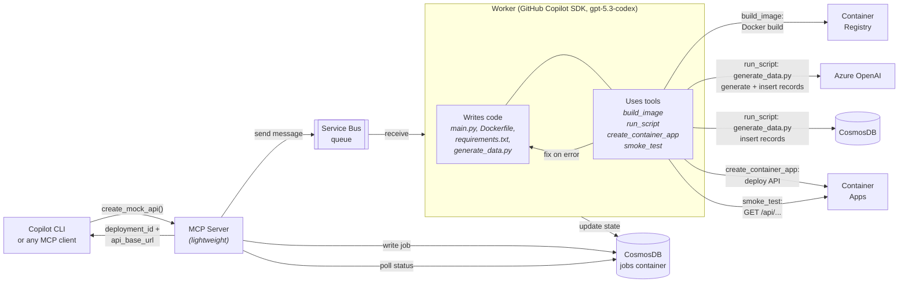

# agentic-component-factory

## The problem

When prototyping or developing software, teams repeatedly need common software
components: APIs, data stores, event pipelines, integration adapters, and
other building blocks. In a world where AI agents help write applications,
these components are still too often delivered as design-time templates.

Template catalogs (for example, Backstage-style component templates) are great
for consistency, but they still leave substantial execution work: generate
code, create data, provision cloud resources, deploy, and validate. That makes
delivery slow and repetitive and forces the main coding agent to spend time on
infrastructure-heavy setup instead of architecture and integration.

## The solution

This project implements one specialized component factory: an MCP tool that
takes a resource name, example records, and an optional data description, then
delivers a fully deployed CRUD REST API backed by CosmosDB with realistic
generated data. The calling AI agent gets back a live URL it can immediately
wire into the application it is building.

Under the hood a lightweight MCP server accepts requests, writes job state to
CosmosDB, and sends a message to a Service Bus queue. A separate Worker service
picks up the message and runs the GitHub Copilot SDK (Azure OpenAI BYOK -- no
GitHub login required) to write API code and data generation scripts. If the
generated code has issues, the SDK self-corrects. Purpose-built tools let the
SDK build Docker images, deploy containers, run scripts, and verify the
result -- all in an autonomous loop.

## Broader vision

The long-term direction is a catalog of specialized agentic component systems,
each exposed via MCP. Instead of selecting only a static template, the main AI
agent can pick a capability and delegate full execution to a specialist agent
system that returns a ready-to-use interface.

In that model:

- A **planner/integration agent** focuses on product architecture and how
  components fit together.
- A **specialist component agent system** handles code generation, synthetic
  data generation, cloud provisioning, deployment, and smoke validation for one
  component type.
- The result is a **running component with integration contract** (URL, schema,
  credentials/identity assumptions, and health signal), not just source files.

`agentic-component-factory` is the first concrete capability in this direction: a mock
API generator with autonomous deployment and data seeding.

## How it works



The MCP server is lightweight — it writes job state to a CosmosDB "jobs"
container, sends a message to Service Bus, and serves poll requests. The Worker
receives the message and runs the Copilot SDK, which **writes code** and
**calls tools** to build images, generate data, deploy containers, and smoke
test. Results are written back to CosmosDB state. If any step fails, the SDK
reads the error, fixes the code, and retries.

## Quick start

### 1. Deploy infrastructure

```bash
cd infra
terraform init
terraform apply \
  -var="subscription_id=YOUR_SUB_ID" \
  -var="mcp_api_key=YOUR_SECRET_KEY"
```

This creates everything in one step:

| Resource | Purpose |
|---|---|
| CosmosDB serverless | Data store for generated APIs + job state (Entra-only) |
| Service Bus (Standard) | Queue `mock-api-jobs` between MCP server and Worker (Entra auth) |
| Container Registry | Builds Docker images for each API |
| Container Apps Environment | Hosts generated APIs, MCP server, and Worker |
| AI Foundry + gpt-5.3-codex | Powers code generation and data synthesis |
| User-assigned managed identity | Entra auth across all services |
| **MCP server Container App** | Lightweight MCP endpoint (1 replica, with ingress) |
| **Worker Container App** | Runs Copilot SDK + codegen (3-10 replicas, KEDA scaling, no ingress) |

Terraform outputs your MCP endpoint:

```
mcp_endpoint = "https://mcp-api-mock-gen.xxxxxxxx.swedencentral.azurecontainerapps.io/mcp"
```

### 2. Configure Copilot CLI

Create new folder, run copilot and configure the MCP server:

```bash
mkdir copilot-test
cd copilot-test
copilot
/mcp add  # Type http, paste the URL, and add the Authorization header with your MCP API key
```

### 3. Use it

Open Copilot CLI and describe what you need:

```
Build me an e-commerce dashboard with products, orders, and customers.
Generate 50 products, 200 orders, and 30 customers with realistic data, no image links.
Then create a React UI that displays everything. Run it for me, tell me how to access it.
```

Copilot will call the MCP server to spin up three live APIs with synthetic
data, then build a frontend connected to them.

Check your Azure portal to see the Container Apps, CosmosDB collections, and
ACR images that were created.


## MCP tools

The server uses an async pattern: `create_mock_api` starts a background job
and returns immediately. Poll `get_deployment_status` until the job completes.

### create_mock_api

Starts a deployment (returns immediately).

| Parameter | Type | Required | Description |
|---|---|---|---|
| name | str | yes | Resource name (e.g. "products") |
| sample_records | list[dict] | yes | Example records (schema + seed data) |
| record_count | int | no | Synthetic records to generate (default: 0) |
| data_description | str | no | Guide for data generation |

Returns `deployment_id` and `status: "running"`.

### get_deployment_status

Poll this until `status` is `"succeeded"` or `"failed"`.

| Parameter | Type | Required | Description |
|---|---|---|---|
| deployment_id | str | yes | ID from create_mock_api |

Returns full deployment state including `api_base_url`, `endpoints`,
`records_seeded`, `records_generated` when succeeded.

### delete_mock_api

| Parameter | Type | Required | Description |
|---|---|---|---|
| deployment_id | str | yes | ID from create_mock_api |

Deletes the Container App and CosmosDB container.

## Tech stack

| Component | Technology |
|---|---|
| MCP server | FastMCP, StreamableHTTP transport (lightweight, no SDK) |
| Worker | Copilot SDK + all skills, scales via KEDA on Service Bus queue depth |
| Messaging | Azure Service Bus Standard, queue `mock-api-jobs`, Entra auth |
| Job state | CosmosDB "jobs" container |
| Code generation | GitHub Copilot SDK, Azure OpenAI BYOK (gpt-5.3-codex) |
| API hosting | Azure Container Apps |
| Image build | Azure Container Registry (ACR remote build) |
| Data store | Azure Cosmos DB serverless (Entra-only) |
| Data generation | Azure OpenAI Responses API, Pydantic structured outputs |
| Auth | User-assigned managed identity, Entra everywhere |
| Infrastructure | Terraform |
